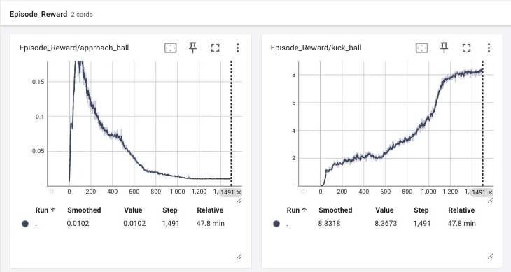

# deepkick-go2-isaac

> **Deep Reinforcement Learning (PPO) for Dynamic Quadrupedal Ball-Kicking on Unitree Go2 in NVIDIA Isaac Lab**

`deepkick-go2-isaac` is a framework built on top of **NVIDIA Isaac Lab** and **RSL-RL** to train the **Unitree Go2** quadruped robot to locate, approach, and kick a dynamic ball object.

## 🚀 Quick Start

### Prerequisites
* NVIDIA Isaac Lab setup on Ubuntu VM instance
* PyTorch & CUDA 12+
* `rsl_rl` library installed

### Execution
Run training in headless mode:

```bash
cd ~/IsaacLab
./isaaclab.sh -p ~/deepkick-go2-isaac/scripts/train.py --num_envs 4096
```

## 📈 Training Performance

Trained for 1,500 iterations (~48 mins on L4 GPU):



* **Kick Velocity Reward**: Consistently scales from 0.0 to ~8.3, confirming forward ball velocity optimization.
* **Termination Control**: Episode duration increases as base contacts (falls) drop near zero.

